# MedLabLingo 🧬

> AI-powered educational tool to help patients understand their medical documents in plain language.

**⚠️ Educational use only. Not medical advice. Not HIPAA compliant.**

[](https://nextjs.org)
[](https://www.typescriptlang.org)
[](LICENSE)

---

## What Is MedLabLingo?

Patients frequently receive medical documents — lab reports, discharge instructions — they can't easily understand. MedLabLingo bridges that gap by:

1. Accepting a **PDF upload** of a lab report or discharge summary
2. **Extracting and redacting** text (PHI removed before any AI call)
3. Running it through an **AI model** to produce a structured, plain-language explanation
4. Displaying **key takeaways**, lab trend tracking, questions for your doctor, and more

---

## Features

- 📄 **PDF text extraction** via `pdf-parse`
- 🔒 **PHI redaction** before sending to AI (emails, phones, MRN, DOB, SSN, addresses)
- 🤖 **AI analysis** — Google Gemini (default) or OpenAI `gpt-4o-mini`
- 🛡️ **Safety filter** — removes medical overreach phrases from AI responses
- 📊 **Lab trend indicators** — compares current values against your history
- 🖨️ **Print-ready report** — formatted export at `/results/print`
- 👨‍⚕️ **Clinician review note** — structured summary at `/clinician/review`
- 💾 **Local history** — up to 10 analyses stored in your browser (24h TTL, auto-pruned)
- 🔁 **Mock mode** — fully functional without any API keys (uses sample data)

---

## Getting Started

### Prerequisites
- Node.js 20+
- npm

### Installation

```bash
# 1. Clone the repo
git clone https://github.com/vedmukul/medlablingo.git
cd medlablingo

# 2. Install dependencies
npm install

# 3. Configure environment (optional — skip for mock mode)
cp .env.example .env.local
# Edit .env.local and add your AI key (see below)

# 4. Start the dev server
npm run dev
```

Open [http://localhost:3000](http://localhost:3000)

---

## Environment Variables

| Variable | Required | Description |
|---|---|---|
| `GOOGLE_AI_API_KEY` | No | **Recommended.** Google Gemini key — used first if set. Get from [Google AI Studio](https://aistudio.google.com/app/apikey) |
| `OPENAI_API_KEY` | No | OpenAI key — fallback if Google key not set. Get from [OpenAI Platform](https://platform.openai.com/api-keys) |

**Provider priority:** Google AI → OpenAI → Mock mode (no keys needed)

> **Mock mode:** If no API keys are set, the app runs fully with realistic sample data. Great for development.

---

## Architecture

### Request Pipeline

```mermaid
flowchart TD
    A(["🧑 Patient\nUploads PDF"]) --> B["POST /api/analyze"]

    subgraph API ["⚙️ API Route — /api/analyze"]
        B --> C["📄 extractText()\npdf-parse"]
        C --> D["🔒 redact()\nStrip PHI"]
        D --> E["🤖 analyzeDocument()\nLLM Call"]
        E --> F{"API Key\nPresent?"}
        F -- Yes --> G["Google Gemini\nor OpenAI GPT-4o-mini"]
        F -- No --> H["📦 Mock Mode\nSample data"]
        G --> I["🛡️ safetyFilter()\nRemove overreach"]
        H --> I
        I --> J["✅ validateAnalysisResult()\nZod schema check"]
        J -- Invalid --> K["🔄 Retry once\nwith schema errors"]
        K --> J
        J -- Valid --> L["📡 Return AnalysisResult JSON"]
    end

    subgraph Browser ["🖥️ Browser"]
        L --> M["💾 saveAnalysis()\nlocalStorage — 24h TTL"]
        M --> N["📊 Results Page"]
        N --> O["📈 LabsTable\n+ Trend Indicators"]
        N --> P["💊 MedicationCards\n+ DischargeChecklist"]
        N --> Q["❓ QuestionsForDoctor"]
        M --> R["🕐 loadHistory()\nTrend Comparison"]
        R --> O
    end

    subgraph Outputs ["📤 Export / Share"]
        N --> S["🖨️ Print Report\n/results/print"]
        N --> T["👨‍⚕️ Clinician Note\n/clinician/review"]
    end
```



### Project Structure

```
src/
├── app/
│   ├── api/
│   │   ├── analyze/        ← PDF upload + full AI pipeline
│   │   └── health/         ← Health check endpoint
│   ├── page.tsx            ← Landing page
│   ├── upload/             ← File picker + document type & reading level options
│   ├── results/
│   │   ├── page.tsx        ← Full analysis display
│   │   └── print/          ← Print-ready formatted report
│   └── clinician/review/   ← Clinician-facing structured summary
├── components/
│   ├── LabsTable.tsx       ← Lab results with flag + trend indicators
│   ├── LabRangeBar.tsx     ← Visual normal/abnormal range bar
│   ├── MedicationCards.tsx ← Discharge medication list
│   ├── DischargeChecklist.tsx
│   ├── QuestionsForDoctor.tsx
│   ├── DisclaimerBanner.tsx
│   ├── SummaryCard.tsx
│   └── Loading.tsx
├── contracts/
│   └── analysisSchema.ts   ← ⚠️ Zod schema — source of truth (migration required to change)
└── lib/
    ├── ai/
    │   ├── analyzeDocument.ts   ← Core AI pipeline (redact → call → retry → validate)
    │   └── providers/           ← openai.ts, gemini.ts, types.ts
    ├── safety/
    │   ├── redact.ts            ← PHI removal before AI call
    │   └── safetyFilter.ts      ← Post-AI medical overreach filter
    ├── compliance/
    │   ├── dataPolicy.ts        ← 24h TTL constants + isExpired()
    │   └── audit.ts             ← Compliance audit event logging
    ├── observability/
    │   ├── logger.ts            ← Structured PHI-free logging
    │   └── rateLimiter.ts       ← Request rate limiting
    └── persistence/
        └── analysisStorage.ts   ← localStorage v2 (10-entry history, auto-prune)
```

---

## Data & Privacy

### What is stored
- Analysis results → **your browser's localStorage only** (never our server)
- Auto-deleted after **24 hours**
- Raw PDF and full extracted text are **never stored**

### What is sent to AI
- Only **redacted text** (PHI stripped first)
- No names, phone numbers, dates of birth, MRN, SSN, or addresses are sent

### How to delete your data
- Click **"Clear saved"** on the results page, or
- Data auto-expires after 24 hours, or
- Clear your browser's localStorage via DevTools

---

## Running Tests

```bash
# All tests
npm test

# Individual suites
npm run test:safety         # Redaction + safety filter
npm run test:compliance     # Audit trail + data retention
npm run test:observability  # Logging + rate limiting
npm run test:ai-smoke       # AI integration (requires OPENAI_API_KEY)
```

---

## Deploying to Vercel

```bash
# Already pushed to GitHub? Just import at:
# https://vercel.com/new → select vedmukul/medlablingo
```

1. Import repo at [vercel.com/new](https://vercel.com/new)
2. Add `GOOGLE_AI_API_KEY` or `OPENAI_API_KEY` in Vercel → Settings → Environment Variables
3. Deploy — Vercel auto-detects Next.js

See [DEPLOYMENT.md](./DEPLOYMENT.md) for the full checklist.

---

## Disclaimer

MedLabLingo is an **educational demonstration** only. It is:
- **NOT a medical device**
- **NOT HIPAA compliant**
- **NOT suitable for clinical or production healthcare use**
- **NOT a substitute for professional medical advice**

Always consult qualified healthcare providers for medical decisions.

---

## License

MIT — see [LICENSE](LICENSE) for details.
